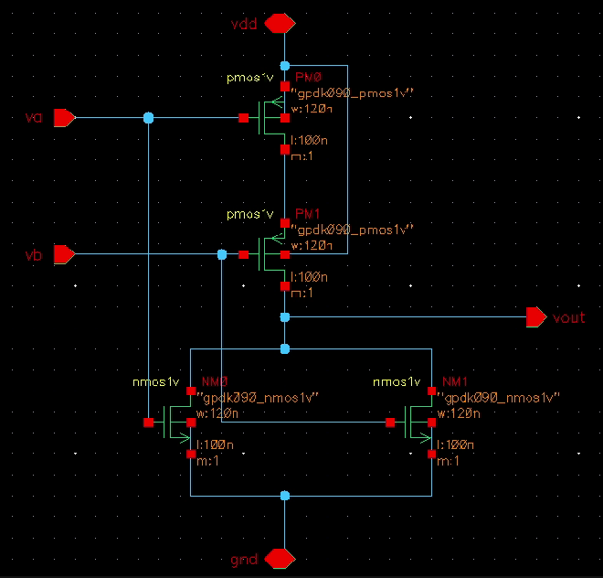
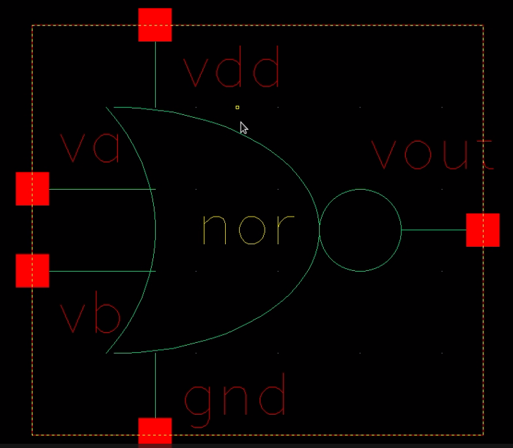
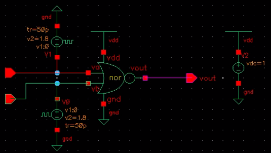
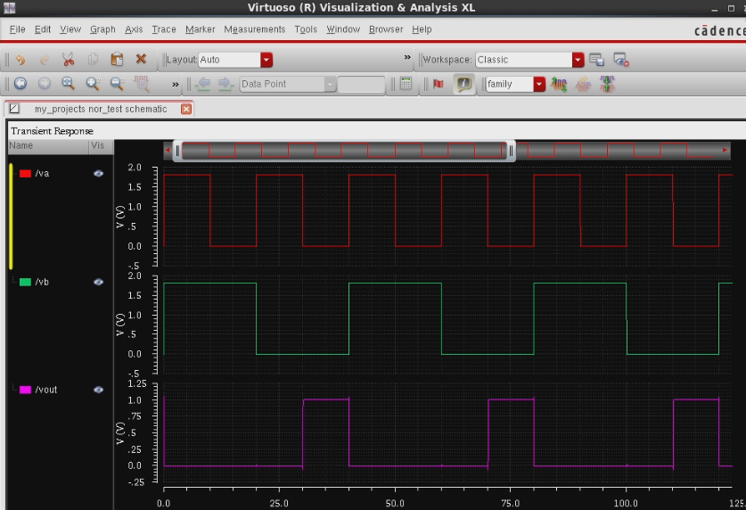
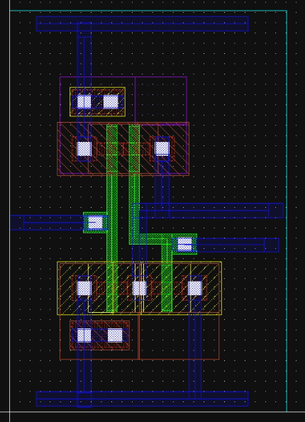
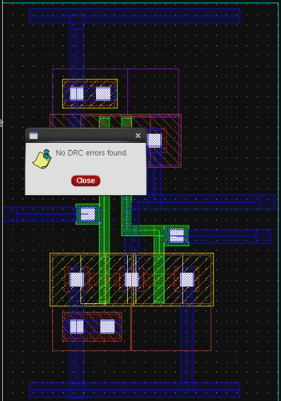
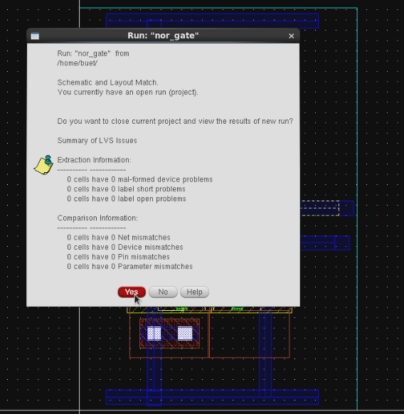
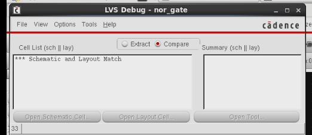
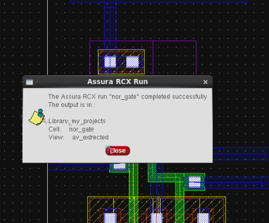
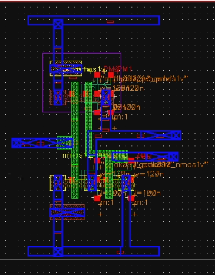

# nor-gate-cadence-project
CMOS NOR Gate design using Cadence Virtuoso including schematic design, simulation, layout implementation and verification (DRC, LVS, REX).

# CMOS NOR Gate Design using Cadence Virtuoso

CMOS NOR Gate design implemented using Cadence Virtuoso including schematic design, symbol creation, simulation, layout implementation and physical verification using DRC, LVS and REX.

---

# 📘 Introduction

Digital logic gates form the fundamental building blocks of digital integrated circuits. Among these gates, the NOR gate is considered a universal logic gate because any digital circuit can be implemented using only NOR gates.

In CMOS technology, logic gates are implemented using complementary MOS transistors (NMOS and PMOS). CMOS circuits provide advantages such as low static power consumption, high noise immunity and high switching performance.

The objective of this project is to design and verify a CMOS NOR gate using the Cadence Virtuoso design environment.

---

# 📊 NOR Gate Truth Table

| A | B | Y |
| - | - | - |
| 0 | 0 | 1 |
| 0 | 1 | 0 |
| 1 | 0 | 0 |
| 1 | 1 | 0 |

Boolean Expression

Y = (A + B)'

---

# 🔧 Schematic Design

The schematic of the CMOS NOR gate was designed using Cadence Virtuoso schematic editor.

The CMOS NOR gate consists of:

• PMOS transistors connected in **series**
• NMOS transistors connected in **parallel**

PMOS transistors form the pull-up network connected to VDD while NMOS transistors form the pull-down network connected to ground.

Inputs A and B are connected to the gates of the MOS transistors and output Y is taken from the common node between pull-up and pull-down networks.

## Schematic Diagram

## Schematic Diagram

---

# 🔧 Symbol Creation

After completing the schematic design, a symbol view of the NOR gate was created so that the gate can be reused as a hierarchical block in larger circuit designs.

The symbol includes two input pins (A and B) and one output pin (Y).

## Symbol

---

# 🔬 Testbench Design

A testbench circuit was created to verify the functionality of the NOR gate. Pulse voltage sources were applied to inputs A and B to generate all possible input combinations.

## Testbench

---

# 🔬 Transient Simulation

Transient analysis was performed using the Spectre simulator in Cadence. The output waveform verifies the correct logical operation of the NOR gate.

When both inputs are LOW, the output becomes HIGH.
If any input becomes HIGH, the output becomes LOW.

## Simulation Waveform

---

# 🧱 Layout Design

After verifying the schematic functionality through simulation, the physical layout of the CMOS NOR gate was created using Cadence Virtuoso Layout Editor.

PMOS transistors were placed in the N-well region while NMOS transistors were placed in the P-substrate region. Proper routing was performed using metal layers following the technology design rules.

## Layout

---

# ✔ Design Rule Check (DRC)

Design Rule Check was performed to ensure that the layout follows all fabrication rules defined by the technology file.

The layout successfully passed all DRC checks.

## DRC Result

DRC Status: **No errors found**

---

# 🔍 Layout vs Schematic (LVS)

LVS verification confirms that the layout implementation matches the schematic design.

The comparison verifies the device connectivity and device count.

## LVS Result

## LVS Match

## LVS Match

LVS Status: **Layout matches Schematic**

---

# ⚡ Parasitic Extraction (REX)

Parasitic extraction was performed to extract parasitic capacitances and resistances from the layout.

These parasitic elements represent the real physical effects present in fabricated ICs.

## REX Extraction

## Extracted View

## Extracted View

REX Status: **Extraction completed successfully**

---

# 🏁 Conclusion

The CMOS NOR gate was successfully designed and verified using Cadence Virtuoso. The project followed the complete custom IC design flow starting from schematic design, symbol creation, simulation, layout implementation and physical verification using DRC, LVS and REX.

The results confirm that the layout implementation accurately represents the schematic design and satisfies all technology design rules.

---

# 🛠 Tools Used

• Cadence Virtuoso
• Assura 
• CMOS Technology

---

# Author

**Abhijit Wankhede**
Analog Layout Engineer | VLSI Enthusiast
